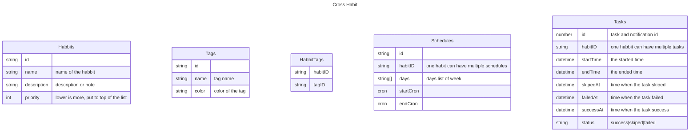

# Cross Habit

A open source cross platform habit tracker.

## Features

- Habit - Track your daily, weekly, monthly, or any routine habit.
- Reminders - Notification your habit and task.
- Statistic - Track your habit statistics and goal.
- Schedules - Flixible schedules.
- Open source - No advertisements and open source.
- Cloud sync - Login to your Google account to sync your habbit and task.
- Sync with Google Calendar - Sync you routine with Google calendar.
- Auto Start and background - Start when turn on the phone and keep it running on background.

## Diagram

Local Notifications: https://capacitorjs.com/docs/apis/local-notifications

## Development

## Links

### Background

<https://capacitorjs.com/docs/v2/apis/background-task>
<https://capacitorjs.com/docs/v2/apis/status-bar>

### Schedule

<https://capacitorjs.com/docs/v2/apis/local-notifications>
<https://github.com/sojinantony01/react-cron-generator>
<https://capacitorjs.com/docs/v2/apis/push-notifications>
<https://github.com/Fir3st/capacitor-calendar>
<https://github.com/go-u/capacitor-alarm-notification>
