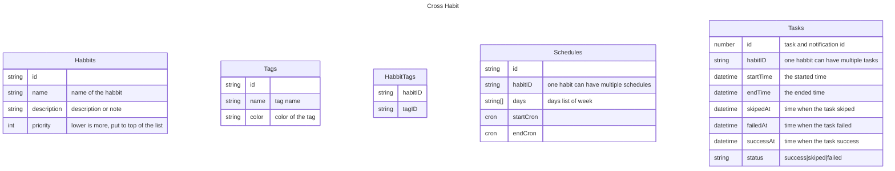

# Cross Habit

A open source cross platform habit tracker.

## Features

- Habit - trak your daily, weekly, monthly, or any routine habit.
- Reminders - notification your habit and task.
- Statistic - track your habit statistics and goal.
- Schedules - flixible schedules.
- Time range - set start and end time of the routine habbit for example if you sleep at 3am can set the new day start at 3am insted of midnight.
- Open source - no advertisements and open source.
- Cloud sync - login to your Google account to sync your habbit and task.
- Auto Start and background - start when turn on the phone and keep it running on background.

## Diagram

Local Notifications: https://capacitorjs.com/docs/apis/local-notifications

## Development

## Links

### Background

<https://capacitorjs.com/docs/v2/apis/background-task>
<https://capacitorjs.com/docs/v2/apis/status-bar>

### Schedule

<https://capacitorjs.com/docs/v2/apis/local-notifications>
<https://github.com/sojinantony01/react-cron-generator>
<https://capacitorjs.com/docs/v2/apis/push-notifications>
<https://github.com/Fir3st/capacitor-calendar>
<https://github.com/go-u/capacitor-alarm-notification>
